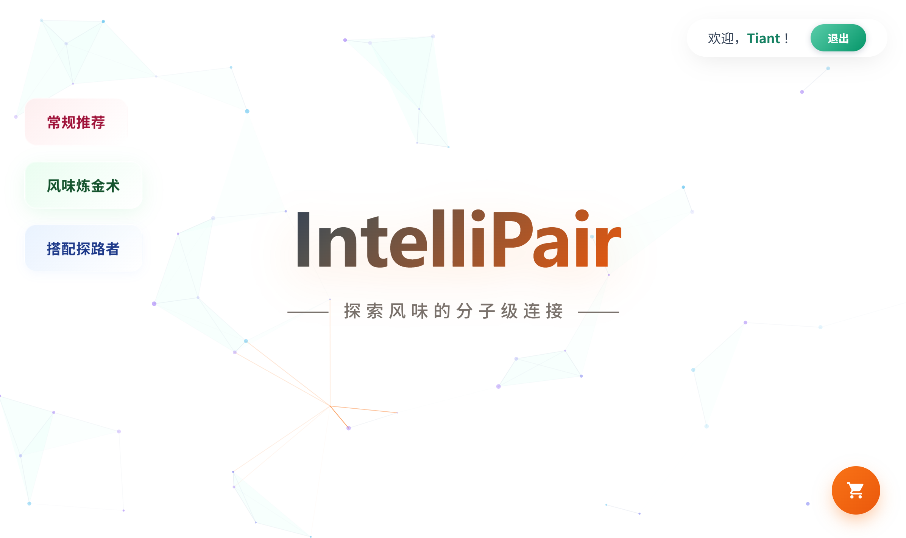
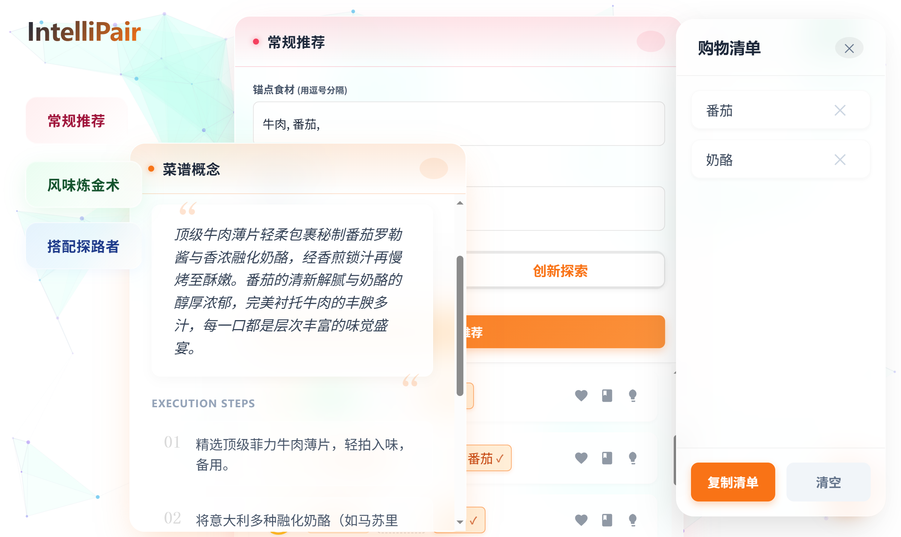

# IntelliPair

> **探索风味的分子级连接**
>
> **IntelliPair** 是一个基于 AI 和知识图谱的智能美食搭配系统。

<p align="center">
  
  
</p>

## 核心特性

*   **双模推荐引擎**
    *   经典模式：基于海量食谱数据的共现分析，寻找最稳妥的美味组合。
    *   创新模式：基于分子层面的风味化合物匹配，探索令人惊喜的创意搭配。
*   **食谱聚合**
    *   并发爬虫架构，实时聚合下厨房、豆果美食、知乎等平台的优质菜谱。
*   **AI 创意主厨**
    *   集成 Google Gemini Falsh2.5模型，生成菜谱概念。

## 技术栈

### Frontend (前端)
*   Vue 3 + Vite
*   Pinia
*   tsParticles
*   VueUse
*   CSS3

### Backend (后端)
*   FastAPI
*   SQLAlchemy + SQLite
*   Pandas / NumPy
*   Httpx + AsyncIO
*   Google Generative AI

## 快速开始

### 1. 环境准备
*   Python 3.9+
*   Node.js 16+

### 2. 数据准备
由于数据集与模型文件体积较大，本项目代码库未包含 `data` 目录。请在运行前按以下步骤配置：

1.  **创建目录**
    在 `backend` 目录下新建 `data` 文件夹。

2.  **数据存放结构**
    请确保 `backend/data/` 目录包含以下内容：

    ```text
    backend/data/
    ├── flavor_network_data/
    ├── LargeRG/
    ├── ingredient_embeddings.npy  # 预训练嵌入向量
    └── aligned_multimodal_embeddings.npy
    ```

3.  **获取方式**
    *   原始数据：请访问相关论文（Flavor Network / Recipe2Vec）下载原始数据集。
    *   向量模型：运行 `python backend/src/recipe2vec.py` 自行训练生成。

### 3. 后端启动
```bash
cd backend

pip install -r requirements.txt
set GOOGLE_API_KEY=你的_Gemini_API_Key
uvicorn main:app --reload
```
后端服务将在 `http://127.0.0.1:8000` 运行。

### 4. 前端启动
```bash
cd frontend

npm install
npm run dev
```
前端页面将在 `http://localhost:5173` 运行。

## 📂 目录结构

```
IntelliPair/
├── backend/
│   ├── src/
│   │   ├── api/          # 路由接口 (recipes, recommend, creative, users)
│   │   ├── core/         # 生命周期与配置
│   │   ├── database/     # 数据库模型
│   │   └── services/     # 业务逻辑与算法
│   ├── data/             # 预训练模型与数据集
│   └── main.py           # 入口文件
└── frontend/
    ├── src/
    │   ├── components/   # UI 组件 (TheBackground, DraggableCard...)
    │   ├── stores/       # Pinia 状态库
    │   └── composables/  # 组合式函数 (useTypewriter...)
    └── index.html
```

